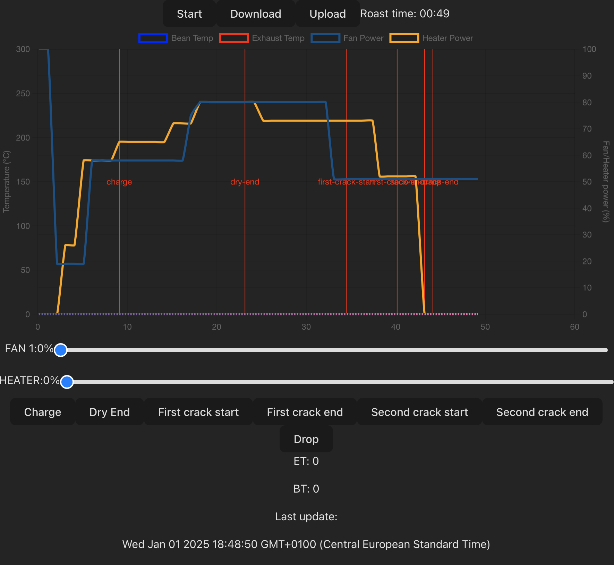
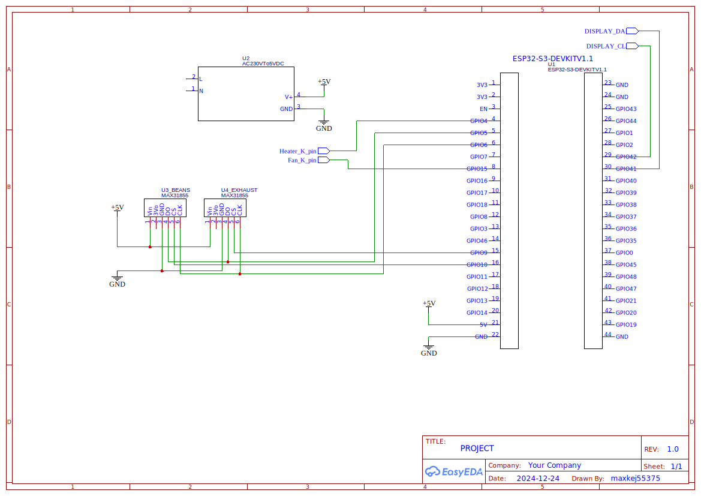

# Yaeger


## Yet another embedded gourmet experience roaster

### or something like that

## The gist

Yaeger is an embedded computer that takes control of your "coffee roaster" via Artisan-Scope.
It currently supports reading data from two temperature probes as well as controlling a fan and pulsing a heater. This is a heavily modified version of the original Yaeger project. 

### Primary goal

Is to use an old popcorn popper you have gathering dust in your basement and modifying it into a sample roaster for
roasting small batches of coffee at a time.

### Suported hardware

* [ESP32-S3 (devkit-1)](https://www.aliexpress.com/item/1005006266375800.html) or an [S3-mini](https://www.aliexpress.com/item/1005006177646698.html)
* 1 or 2 [MAX31855](https://www.aliexpress.com/item/1005006381598473.html) thermocouple chips
* 1 [DC pwm capable dimmer](https://www.aliexpress.com/item/1005006457613501.html) for the fan (must support 3.3v control)
* 1 DC controlled [AC SSR](https://www.aliexpress.com/item/4000045425145.html) for controling the heating element (same as above)

### Other required hardware for the build

* 18V DC PSU for driving the fan (be careful how you wire this)
* regular wire K-type thermocouple probe (the one that comes with your multimeter)
* flexible K-type thermocouple probe, 1x50/1.5x50 (sometimes difficult to source, they come and go on aliexpress, search for
flexible thermocouple 1x100 - this usually works).

### NOTE

We don't have enough data if there is enough difference between ET and BT to justify two thermocouples. You might use
just one.

#### Optional upgrades

* 24V DC PSU for more fan power

### Command and control


Upon first launch, Yaeger will set up its own access point. You can then configure the preferred wifi for Yaeger to
connect to from the Web UI (see below). After setting up the preffered Wifi, Yaeger will try to connect to it on every
boot. If it can't connect to the preffered Wifi, Yaeger will fallback to its own access point (so you can set up Wifi
again).
This repo also includes a sample config for Artisan-Scope.

#### Artisan Scope

Load the config, found in `./artisan-settings.aset` into Artisan-Scope, change the server ip to match yours and click the on button.

#### Web interface

Yaeger ships with a built-in single-page dashboard served from the device. Point your browser at `yaeger.local` when on
your home wifi, or `192.168.4.1` if Yaeger created its own access point. No app to install — the firmware serves the UI
from LittleFS.

The dashboard shows live temp/ROR/burner/fan plotted with ECharts, a profile editor in the strip beneath the chart, and
collapsible settings panels (PID, WiFi, Profile, Saved Roasts) at the bottom. Designed for a 10" 1080×800 touchscreen
mounted on the roaster, but works in any modern browser.



#### Using Yaeger on the go

If Yaeger can't connect to your preferred Wifi, it will create its own access point. Perfect for when out and about :grin:

## Build guide (WIP)

### Schema



Kicad projects for the S3 and S3 mini versions of the PCB, can be found in the PCB folder, along with a BOM for the pcb.

Courtesy of [@dlisec](https://github.com/dlisec)

### Building and flashing

A build script has been provided by [@matthew73210](https://github.com/matthew73210), so to get up and running on the
ESP, just run `./build_and_flash.sh`. Make sure to read the comments in the script. But also in the platformio.ini and choose the right board

## Latest features

### Firmware-owned PID and profile execution

The on-device PID loop owns the roast once it starts. The webapp pushes the profile to firmware at "Start Roast" and
the ESP32 then autonomously interpolates the setpoint and drives the heater + fan. The webapp becomes a live viewer.

The big upside: **WebSocket disconnects no longer break the roast**. The roaster keeps following its profile, the
dashboard auto-reconnects with exponential backoff, and the chart back-fills from the firmware's 1 Hz history buffer
on reconnect.

You'll still need to find your own PID values for your hardware — kp/ki/kd are saved in NVS preferences.

### Profile editor in the dashboard

A full-width strip under the chart lets you click any profile point to select it, then nudge time / temperature / fan
with ±30 s, ±1 °C, ±5 % buttons. Edits push to firmware in real time so they take effect mid-roast within ~100 ms.

Eight profile slots can be saved to the device's LittleFS partition for later. Roasts are downloadable as JSON or as a
PNG snapshot of the chart with one button press.

### Reliability & safety

* **Auto-reconnect** with exponential backoff. Commands issued while offline get queued and flushed in order on
  reconnect. **All Off** always jumps to the front of the queue.
* **Safety watchdog**: if the WebSocket has been silent for more than 5 minutes _and_ BT is over 230 °C while a roast
  is following a profile, firmware fires All Off automatically.

### Fan modes (PWM or SSR)

Toggle between PWM dimmer (continuous 0-100%) and a digital SSR (on/off, threshold > 0). Selectable in the PID Settings
panel, applied on next boot. Same wiring pin either way.

### Roast profile formats

Two JSON shapes are accepted by the loader; both round-trip through the in-app editor.

Phased format (heater + fan timelines, easy to author):

```json
{
  "name": "second profile",
  "heaterPhases": [
    { "time": 0,   "temperature": 50  },
    { "time": 60,  "temperature": 120 },
    { "time": 780, "temperature": 224 }
  ],
  "fanPhases": [
    { "time": 0,   "fanSpeed": 95 },
    { "time": 420, "fanSpeed": 50 }
  ]
}
```

Legacy "steps" format (duration-based segments):

```json
{
  "steps": [
    { "duration": 10,  "setpoint": 40,  "interpolation": "linear" },
    { "duration": 360, "setpoint": 217, "interpolation": "ease-out" }
  ]
}
```

You can also try the [Gaggiuino web profiler](https://matthew73210.github.io/Gaggiuino-web-profiler/) under the _pun_
"Yägermeister Mode" to generate profiles.

## Disclaimer

Be careful when messing about with electronics and high voltage. I can not and will not take any responsibility for any
sort of damage or injury caused by Yaeger, either directly or indirectly.
**You do this at your own risk**

## You have been warned
