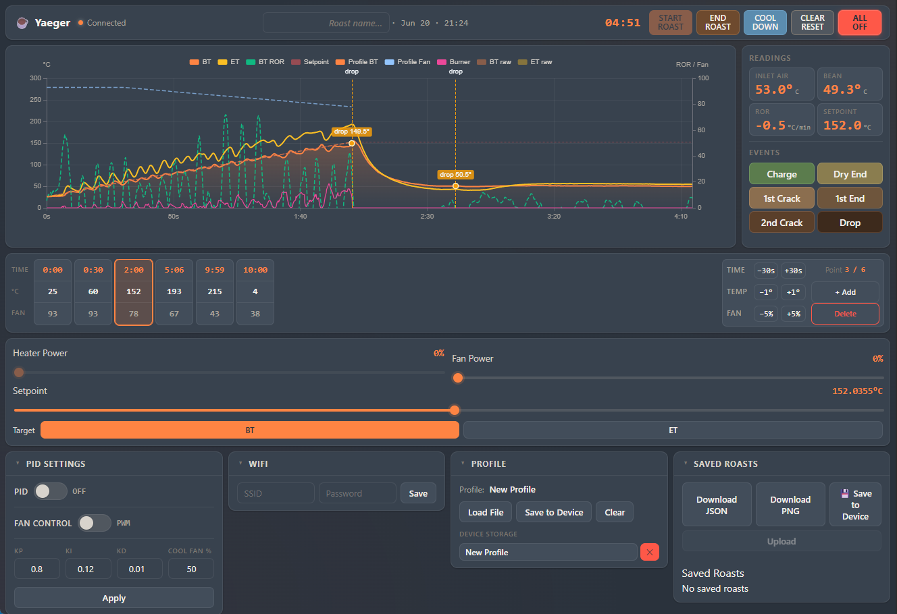

# Yaeger



## Yet another embedded gourmet experience roaster

### or something like that

## The gist

Yaeger is an embedded computer that takes control of your "coffee roaster". It reads from up to two
thermocouples, drives a fan via PWM (or a digital SSR), and modulates a heating element through an
AC SSR. The firmware ships with its own touchscreen-friendly web dashboard served straight off the
device, and also speaks the Artisan-Scope WebSocket protocol for users who prefer that workflow.

This is a heavily modified fork of the original Yaeger project.

### Command and control


Upon first launch, Yaeger will set up its own access point. You can then configure the preferred wifi for Yaeger to
connect to from the Web UI (see below). After setting up the preffered Wifi, Yaeger will try to connect to it on every
boot. If it can't connect to the preffered Wifi, Yaeger will fallback to its own access point (so you can set up Wifi
again).
This repo also includes a sample config for Artisan-Scope.

#### Artisan Scope

Load the config, found in `./artisan-settings.aset` into Artisan-Scope, change the server ip to match yours and click the on button.

> **Don't mix flows.** The firmware can either be driven by Artisan (Artisan sends `setBurner` /
> `setFan` directly to the heater + fan) or by the dashboard's profile execution (Start Roast →
> firmware autonomously interpolates the setpoint and runs PID). If you click **Start Roast** in
> the dashboard, the firmware re-writes the setpoint every ~100 ms from the loaded profile, and
> Artisan's burner commands will get overwritten. Pick one:
>
> * **Artisan-driven**: leave PID **off** in the dashboard's PID Settings panel and don't press
>   Start Roast. The dashboard becomes a live viewer; Artisan has full control.
> * **Dashboard-driven**: load a profile, press Start Roast. Artisan can still read temps but
>   can't move the burner.

#### Web interface

Yaeger ships with a built-in single-page dashboard served from the device. Point your browser at `yaeger.local` when on
your home wifi, or `192.168.4.1` if Yaeger created its own access point. No app to install — the firmware serves the UI
from LittleFS.

#### Using Yaeger on the go

If Yaeger can't connect to your preferred Wifi, it will create its own access point. Perfect for when out and about :grin:

### Building and flashing

A build script has been provided by [@matthew73210](https://github.com/matthew73210), so to get up and running on the
ESP, just run `./build_and_flash.sh`. Make sure to read the comments in the script. But also in the platformio.ini and choose the right board

## Latest features

### Firmware-owned PID and profile execution

The on-device PID loop owns the roast once it starts. The webapp pushes the profile to firmware at "Start Roast" and
the ESP32 then autonomously interpolates the setpoint and drives the heater + fan. The webapp becomes a live viewer.

The big upside: **WebSocket disconnects no longer break the roast**. The roaster keeps following its profile, the
dashboard auto-reconnects with exponential backoff, and the chart back-fills from the firmware's 1 Hz history buffer
on reconnect.

You'll still need to find your own PID values for your hardware — kp/ki/kd are saved in NVS preferences.

### Profile editor in the dashboard

A full-width strip under the chart lets you click any profile point to select it, then nudge time / temperature / fan
with ±30 s, ±1 °C, ±5 % buttons. Edits push to firmware in real time so they take effect mid-roast within ~100 ms.

Eight profile slots can be saved to the device's LittleFS partition for later. Five roast slots too — saves are
1 Hz downsampled so a 15-minute roast lands at ~150-300 KB on flash, while the local "Download JSON" button still
gives you the full 10 Hz capture. There's also a one-click "Download PNG" for a chart snapshot.

### End-of-roast workflow

* **Start Roast** auto-records the **Charge** event so the chart's `charge` marker lands at t=0.
* **End Roast** records a **Drop** event, asks the firmware to stop following, and enters cool-down (Manual mode,
  heater 0, fan to the configured Cooldown Fan %).
* **Auto-drop**: while in PID mode following a profile, the third Controls slider becomes a **Target BT** slider
  (default 230 °C). When the live BT crosses that value, the same drop-→-cool-down path fires automatically.
* **Save modal**: once BT drops below 50 °C the dashboard opens a modal with a roast-name input and one button that
  saves JSON to device + downloads JSON locally + downloads a PNG of the chart. Then All Off.
* **Clear Reset** in the top bar wipes the chart, event markers, modal state, and asks firmware to end any
  in-progress roast — back to a fresh state.
* Each event (charge / dry-end / 1st & 2nd crack / drop) drops a colored dot on the BT line in the chart, labeled
  with the BT at that moment. Buttons in the Events panel are color-coded along the bean-roast progression too
  (green raw → tan → cinnamon → browns → near-black drop).

### Reliability & safety

* **Auto-reconnect** with exponential backoff. Commands issued while offline get queued and flushed in order on
  reconnect. **All Off** always jumps to the front of the queue.
* **Safety watchdog**: if the WebSocket has been silent for more than 5 minutes _and_ BT is over 230 °C while a roast
  is following a profile, firmware fires All Off automatically.

### Fan modes (PWM or SSR)

Toggle between PWM dimmer (continuous 0-100%) and a digital SSR (on/off, threshold > 0). Selectable in the PID Settings
panel, applied on next boot. Same wiring pin either way.

### Roast profile formats

Two JSON shapes are accepted by the loader; both round-trip through the in-app editor.

Phased format (heater + fan timelines, easy to author):

```json
{
  "name": "second profile",
  "heaterPhases": [
    { "time": 0,   "temperature": 50  },
    { "time": 60,  "temperature": 120 },
    { "time": 780, "temperature": 224 }
  ],
  "fanPhases": [
    { "time": 0,   "fanSpeed": 95 },
    { "time": 420, "fanSpeed": 50 }
  ]
}
```

Legacy "steps" format (duration-based segments):

```json
{
  "steps": [
    { "duration": 10,  "setpoint": 40,  "interpolation": "linear" },
    { "duration": 360, "setpoint": 217, "interpolation": "ease-out" }
  ]
}
```
## Pi setup as Kiosk

1. Install FullPageOS onto a Raspberry Pi.
2. Connect GPIO 3 (pin 5) and GND (pin 6) to a momentary switch — gives you a hardware shutdown
   button after step 8.
3. Plug in a keyboard.
4. Press `Ctrl+Alt+F1` to access the terminal.
5. Bring up a WiFi hotspot so the ESP32 has a network to join, and make it auto-start on boot:
   ```sh
   sudo nmcli device wifi hotspot ssid MyFullPageHotspot password MyPassword123
   sudo nmcli connection modify Hotspot connection.autoconnect yes
   sudo nmcli connection modify Hotspot connection.autoconnect-priority 100
   ```
6. Edit the boot config: `sudo nano /boot/firmware/config.txt`.
7. At the bottom, add `dtoverlay=gpio-shutdown`.
8. Press `Ctrl+O`, then `Enter` to save. Press `Ctrl+X` to exit nano.


## Web Profile Creation (maybe works?)
You can also try the [Gaggiuino web profiler](https://matthew73210.github.io/Gaggiuino-web-profiler/) under the _pun_
"Yägermeister Mode" to generate profiles.

## Disclaimer

Be careful when messing about with electronics and high voltage. I can not and will not take any responsibility for any
sort of damage or injury caused by Yaeger, either directly or indirectly.
**You do this at your own risk**

## You have been warned
